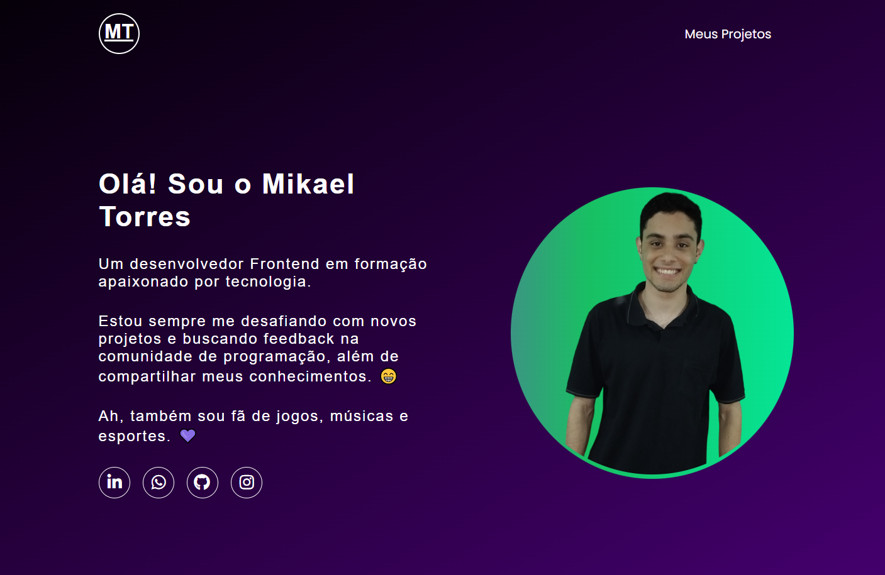

# 💼 Portfolio

Meu portfólio pessoal desenvolvido com o objetivo de apresentar meus projetos, habilidades e evolução como desenvolvedor front-end.

---

## 🚀 Tecnologias utilizadas

- React
- Vite
- Tailwind CSS
- JavaScript (ES6+)

---

## 📸 Preview

---

## 🌐 Acesse o projeto

👉 [Ver portfólio online](https://portfolio-brown-eta-66.vercel.app/)

---

## 📂 Projetos em destaque

- 🧮 Age Calculator App (Projeto 6)
Aplicação que calcula idade em anos, meses e dias, com validação completa de formulário e interface responsiva.

---

## 🧠 Sobre mim

Sou desenvolvedor front-end em constante evolução, focado em criar interfaces modernas, funcionais e bem estruturadas.

---

## 📫 Contato

- LinkedIn: [https://www.linkedin.com/in/mikael-torres/]
- Email: [Mikaelt76@gmail.com]

---
